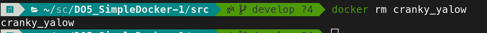
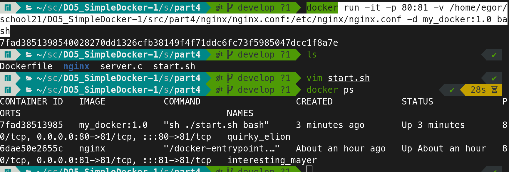

# Simple Docker

Введение в докер. Разработка простого докер образа для собственного сервера.


## Contents

1. [Готовый докер](#part-1-готовый-докер)
2. [Операции с контейнером](#part-2-операции-с-контейнером)
3. [Мини веб-сервер](#part-3-мини-веб-сервер)
4. [Свой докер](#part-4-свой-докер)
5. [Dockle](#part-5-dockle)
6. [Базовый Docker Compose](#part-6-базовый-docker-compose)

## Part 1. Готовый докер

В качестве конечной цели своей небольшой практики ты сразу выбрал написание докер образа для собственного веб-сервера, а потому в начале тебе нужно разобраться с уже готовым докер-образом для сервера.
Твой выбор пал на довольно простой **nginx**.

**== Задание ==**

- Возьми официальный докер образ с **nginx** и выкачай его при помощи `docker pull`
  

- Проверь наличие докер образа через `docker images`
  

- Запусти докер образ через `docker run -d [image_id|repository]`
  
  -d (--detach) means: Run container in background and print container ID

- Проверь, что образ запустился через `docker ps`
  

- Посмотри информацию о контейнере через `docker inspect  [container_id|container_name]`
  По выводу команды определи и помести в отчёт размер контейнера, список замапленных портов и ip контейнера.
  Использовал команду `docker inspect -s cf5edc1c675d > docker_inspect.log `. Флаг `-s` нужен для размера.

  - Размер контейнера:
    SizeRootFs: 186703997 байт
    
  - Список замапленных портов:
    Порт 80/tcp
    
  - IP контейнера:
    IPAddress: 172.17.0.2
    


- Останови докер образ через `docker stop [container_id|container_name]`
  

- Проверь, что образ остановился через `docker ps`
  

- Запусти докер с портами 80 и 443 в контейнере, замапленными на такие же порты на локальной машине, через команду *run*

  Маппинг портов (или порт-маппинг) в контексте Docker означает соотнесение портов контейнера с портами хоста. Когда вы запускаете контейнер с использованием опции -p или --publish в команде docker run, вы устанавливаете правило маппинга портов.
  Используем команду `docker run -p 80:80 -p 443:443 имя_образа`
   - -p 80:80 маппит порт 80 контейнера на порт 80 хоста.
   - -p 443:443 маппит порт 443 контейнера на порт 443 хоста.
   - имя_образа заменить на имя или ID образа, который вы хотите запустить.
  

- Проверь, что в браузере по адресу *localhost:80* доступна стартовая страница **nginx**
  
  
- Перезапусти докер контейнер через `docker restart [container_id|container_name]`
  

- Проверь любым способом, что контейнер запустился
  

## Part 2. Операции с контейнером

Докер образ и контейнер готовы. Теперь можно покопаться в конфигурации **nginx** и отобразить статус страницы.

**== Задание ==**

- Прочитай конфигурационный файл *nginx.conf* внутри докер контейнера через команду *exec*
  Используем команду `docker exec cranky_yalow cat etc/nginx/nginx.conf`
  

 - Создай на локальной машине файл *nginx.conf*
  

- Настрой в нем по пути */status* отдачу страницы статуса сервера **nginx**. Для этого нужно добавить:
```
  server {
    listen 80; # Устанавливаем порт, на котором сервер будет слушать входящие соединения.
    location /status { # Настройка обработку запросов к /status.
    stub_status on; # Включаем модуль stub_status для предоставления страницы статуса сервера nginx.
    }
  }

```
  Получается такой конфигурационный файл:
  
  Теперь nginx может отвечать на запросы к /status и предоставлять информацию о текущей работе сервера.

- Скопируй созданный файл *nginx.conf* внутрь докер образа через команду `docker cp`
  `docker cp nginx.conf cranky_yalow:etc/nginx/nginx.conf`
  

- Перезапусти **nginx** внутри докер образа через команду *exec*
  `docker exec cranky_yalow nginx -s reload`
  

- Проверь, что по адресу *localhost:80/status* отдается страничка со статусом сервера **nginx**
  

- Экспортируй контейнер в файл *container.tar* через команду *export*
  `docker export cranky_yalow > latest.tar`
  

- Останови контейнер
  

- Удали образ через `docker rmi [image_id|repository]`, не удаляя перед этим контейнеры
  `docker rmi nginx -f`
  Без `-f` ошибка: `Error response from daemon: conflict: unable to delete a8758716bb6a (must be forced) - image is being used by stopped container cf5edc1c675d`
  

- Удали остановленный контейнер
  

- Импортируй контейнер обратно через команду *import*
  `docker import latest.tar nginx:imported`
  

- Запусти импортированный контейнер
  `docker run -d -p 80:80 -p 443:443 nginx`
  

- Проверь, что по адресу *localhost:80/status* отдается страничка со статусом сервера **nginx**
  
  Ошибка. При экспорте сбрасывается entrypoint. Можно задать пользовательскую точку входа либо при запуске: `docker run -d -p 80:80 --entrypoint 'nginx -g "daemon off;"' my_nginx`, либо при импортировании `docker import -c 'CMD nginx -g "daemon off;"' latest.tar ne_container`
  
  Теперь страница со статусом доступна.
  

## Part 3. Мини веб-сервер

Настало время немного оторваться от докера, чтобы подготовиться к последнему этапу. Настало время написать свой сервер.

**== Задание ==**

- Напиши мини-сервер на **C** и **FastCgi**, который будет возвращать простейшую страничку с надписью `Hello World!`
  

- Запусти написанный мини-сервер через *spawn-fcgi* на порту 8080
  Берём новый образ и запускаем новый контейнер.
  `docker run -d -p 81:81 nginx  `
  
  Перекидываем сервер в новый контейнер
  `docker cp server.c interesting_mayer:/home`
  Заходим в терминал контейнера
  `docker exec -it interesting_mayer bash`
  Обновляемся 
  `apt-get update`
  Устанавливаем пакеты
  `apt-get install -y gcc spawn-fcgi libfcgi-dev`
  Компилируем сервер (в той директории, куда положили его)
  `gcc server.c -o server -lfcgi`
  Запускаем и получаем id процесса.
  `spawn-fcgi -p 8080 server`
  

- Напиши свой *nginx.conf*, который будет проксировать все запросы с 81 порта на *127.0.0.1:8080*
  
  Здесь проксирование:
  ```
  server {
    listen 81;
    server_name localhost;

    location / { #для всех запросов, начинающихся с /
        fastcgi_pass 127.0.0.1:8080; #переслать запросы FastCGI-серверу, который слушает на 127.0.0.1:8080.
    }
  }

  ```
  Проксирование в веб-контексте — это как посредник между клиентом (например, веб-браузером пользователя) и сервером, где хранится содержимое веб-сайта. Этот посредник (прокси-сервер) принимает запросы от клиента и передает их серверу, а затем передает ответы от сервера обратно клиенту.
  Перекидываем конфигурацию в новый контейнера
  `docker cp nginx/nginx.conf interesting_mayer:/etc/nginx/`
  И перезапускаем
  `docker exec interesting_mayer nginx -s reload`
  

- Проверь, что в браузере по *localhost:81* отдается написанная тобой страничка
  

## Part 4. Свой докер

Теперь всё готово. Можно приступать к написанию докер-образа для созданного сервера.

**== Задание ==**

*При написании докер-образа избегайте множественных вызовов команд RUN*

- Напиши свой докер образ, который:
  1) собирает исходники мини сервера на FastCgi из [Части 3](#part-3-мини-веб-сервер)
  2) запускает его на 8080 порту
  3) копирует внутрь образа написанный *./nginx/nginx.conf*
  4) запускает **nginx**.
  Докерфайл
  
  Скрипт для сборки сервера
  

- Собери написанный докер образ через `docker build` при этом указав имя и тег. Проверь через `docker images`, что все собралось корректно
  

- Запусти собранный докер образ с маппингом 81 порта на 80 на локальной машине и маппингом папки *./nginx* внутрь контейнера по адресу, где лежат конфигурационные файлы **nginx**'а (см. [Часть 2](#part-2-операции-с-контейнером))
  `docker run -it -p 80:81 -v /home/egor/school21/DO5_SimpleDocker-1/src/part4/nginx/nginx.conf:/etc/nginx/nginx.conf -d my_docker:1.0 bash`
  

- Проверь, что по localhost:80 доступна страничка написанного мини сервера
  

- Допиши в *./nginx/nginx.conf* проксирование странички */status*, по которой надо отдавать статус сервера **nginx**
  Открываем конфиг и добавляем проксирование странички статуса
  

- Перезапусти докер образ
   Запускаем баш на докере 
  `docker exec -it quirky_elion bash`
  Перезапускаем 
  `nginx -s reload`

- Проверь, что теперь по *localhost:80/status* отдается страничка со статусом **nginx**
  

## Part 5. **Dockle**

После написания образа никогда не будет лишним проверить его на безопасность.

**== Задание ==**

- Просканируй образ из предыдущего задания через `dockle [image_id|repository]`
  

- Исправь образ так, чтобы при проверке через **dockle** не было ошибок и предупреждений
  - CIS-DI-0007: Do not use update instructions alone in the Dockerfile, DKL-DI-0005: Clear apt-get caches:
  ```
  # Объединяем apt-get update с apt-get install и oчищаем кэш apt-get после установки пакетов
  RUN apt-get update && apt-get install -y gcc spawn-fcgi libfcgi-dev && rm -rf /var/lib/apt/lists/*

  ```
  - CIS-DI-0001: Create a user for the container:
  `USER nginx`

  Чтобы пофиксить CIS-DI-0010 в чате предлагали либо использовать старую версию nginx, либо брать образ убунты и на него ставить nginx, либо скрывать эту ошибку флагом --accept-key. Из всего этого мне помог второй способ, в итоге докерфайл выглядит так: 
  
  Теперь новый образ без ошибок
  


## Part 6. Базовый **Docker Compose**

Вот ты и закончил свою разминку. А хотя погодите...
Почему бы не поэкспериментировать с развёртыванием проекта, состоящего сразу из нескольких докер образов?

**== Задание ==**

- Напиши файл *docker-compose.yml*, с помощью которого:
  - 1) Подними докер-контейнер из [Части 5](#part-5-инструмент-dockle) _(он должен работать в локальной сети, т.е. не нужно использовать инструкцию **EXPOSE** и мапить порты на локальную машину)_
  - 2) Подними докер-контейнер с **nginx**, который будет проксировать все запросы с 8080 порта на 81 порт первого контейнера
    

- Замапь 8080 порт второго контейнера на 80 порт локальной машины
  

- Останови все запущенные контейнеры
  

- Собери и запусти проект с помощью команд `docker-compose build` и `docker-compose up`
  
  

- Проверь, что в браузере по *localhost:80* отдается написанная тобой страничка, как и ранее
  


